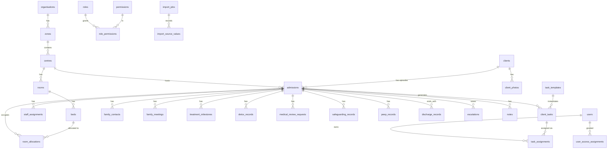

# Data Model

**Status:** proposed, Phase 0. Not yet implemented — no migrations written.
Target: PostgreSQL via Supabase. All tables carry RLS; see [SECURITY_MODEL.md](SECURITY_MODEL.md).

---

## Design principles

1. **The client file is the source of truth.** The dashboard is a projection. No value is stored
   twice.
2. **Client ≠ admission.** A client persists; an admission is one episode. Tasks, allocations,
   milestones and discharge records hang off the **admission**, so a returning client's history stays
   separate and intact.
3. **The bed is the allocatable unit**, not the room. Single rooms have one bed; shared rooms have
   several. This mirrors how the whiteboard already works (6A and 6B are separate rows).
4. **Due ≠ done.** `due_date` and `completed_at` are always distinct columns. Never overwrite one
   with the other. This is the workbook's central defect and it is designed out at the schema level.
5. **Append-only history.** Allocations, task events, discharge-date changes and audit rows are added,
   never updated in place or deleted.
6. **No hard-coded centre, room or person.** Primrose Lodge is a row. Room `6A` is a row. A regional
   manager's access is a row in `user_access_assignments`. Nothing about any of them appears in code.
7. **Sensitivity is a column, not a convention.** Tables holding levels 2–4 carry an explicit
   `visibility_level`, and RLS reads it.
8. **Deny by default.** Absence of an access assignment means no access, everywhere.

---

## Entity overview



`audit_events` is deliberately outside the diagram: it references every table polymorphically and
depends on nothing.

---

## 1. Organisation hierarchy

### `organisations`
`id` · `name` · `slug` · `is_active` · timestamps.
One row for v1. Present so multi-tenancy is not a rewrite. Every scoped table carries
`organisation_id`.

### `zones`
`id` · `organisation_id` → · `name` · `code` · `is_active` · timestamps.
A region or zone. A centre belongs to at most one zone; a user may be scoped to a zone (inheriting
all its centres) or to individual centres.

### `centres`
`id` · `organisation_id` → · `zone_id` → (nullable) · `name` · `slug` · `timezone` (default
`Europe/London`) · `is_active` · `settings` **jsonb** · timestamps.

`settings` holds per-centre operational configuration so a new centre needs no code:
```jsonc
{
  "doctor_review_weekday": 4,            // 1=Mon. Column AG hard-codes Thursday; this replaces it.
  "family_meeting_eligibility_hours": 168,
  "initial_family_contact_hours": 24,
  "pre_discharge_contact_hours": 24,
  "discharge_inclusive_of_admission_day": true,  // pending Q3
  "default_duration_days": 28
}
```
Primrose Lodge is seeded as the first row.

### `rooms`
`id` · `centre_id` → · `label` **text** · `room_type` (`single` | `shared`) · `floor` ·
`accessibility_notes` · `status` (`available` | `maintenance` | `closed`) · `is_active` · timestamps.
Unique `(centre_id, label)`.

### `beds`
`id` · `room_id` → · `centre_id` → *(denormalised for RLS and index efficiency)* · `label` **text**
· `status` (`available` | `maintenance` | `closed`) · `is_active` · `sort_order` · timestamps.
Unique `(centre_id, label)`.

> `label` is **text**, never numeric. The workbook stores 14 room numbers as numbers and 4 as text;
> in this model `1` and `6A` are both strings and sort by `sort_order`.

Primrose Lodge seeds as 16 rooms / 18 beds: rooms 1–5, 7, 8, 10–16 single (one bed each, label =
room label); rooms 6 and 9 shared (beds `6A`/`6B`, `9A`/`9B`).

---

## 2. Identity, roles and access

### `users`
`id` (= `auth.users.id`) · `email` · `full_name` · `job_title` · `is_active` · `last_seen_at` ·
timestamps. Profile mirror of Supabase Auth. Deactivation is a flag; users are never deleted.

### `roles`
`id` · `code` · `name` · `description` · `is_system`.
Seeded: `platform_admin`, `regional_operations`, `supervisor`, `centre_manager`, `therapist`,
`support_staff`, `helpdesk`, `doctor`, `read_only`.

### `permissions`
`id` · `code` · `description` · `sensitivity_level` (1–4).
Fine-grained verbs, e.g. `client.read`, `admission.create`, `bed.allocate`, `task.complete.clinical`,
`photo.verify`, `safeguarding.read_narrative`, `discharge.approve_early`, `audit.read`, `export.client_data`.

### `role_permissions`
`role_id` → · `permission_id` → . Composite PK. The editable role definition.

### `user_access_assignments`
The heart of the access model. One row = one grant.

`id` · `user_id` → · `role_id` → · `scope_type` (`organisation` | `zone` | `centre`) ·
`scope_id` **uuid** · `is_read_only` **bool** · `starts_at` · `ends_at` **(nullable)** ·
`granted_by` → · `grant_reason` **text** · `revoked_at` · `revoked_by` → · timestamps.

- A user may hold **several** assignments — therapist at centre A, supervisor at centre B.
- **Temporary cover** is simply an assignment with an `ends_at`, a mandatory `grant_reason` and a
  `granted_by`. Expiry is automatic because every policy filters on
  `now() between starts_at and coalesce(ends_at,'infinity')`. Nothing has to run for access to lapse.
- Regional visibility is a `zone`-scoped assignment. **No person is named in code.**
- Index: `(user_id, scope_type, scope_id) where revoked_at is null`.

---

## 3. Clients and admissions

### `clients`
`id` · `organisation_id` → · `reference` **text unique** *(system-generated — the workbook has no
client identifier at all)* · `first_name` · `last_name` · `preferred_name` · `date_of_birth`
**(nullable — only if confirmed operationally necessary)** · `status` (`active` | `archived`) ·
`created_by` → · `updated_by` → · timestamps.

No clinical fields. No address, phone, NHS number or next-of-kin until a specific need is agreed —
see [SECURITY_MODEL.md](SECURITY_MODEL.md) on data minimisation.

### `client_photos`
`id` · `client_id` → · `storage_path` **text** *(private bucket)* · `safe_filename` ·
`original_filename` · `mime_type` · `size_bytes` · `uploaded_by` → · `uploaded_at` ·
`verification_status` (`unverified` | `verified` | `rejected`) · `verified_by` → · `verified_at` ·
`replaces_photo_id` → self · `is_active` **bool** · `rejection_reason`.

Replacement inserts a new row and clears `is_active` on the old one — history is never deleted.
Partial unique index: one `is_active` photo per client. Files live in a **private** bucket accessed
only through short-lived signed URLs.

### `admissions`
`id` · `client_id` → · `centre_id` → · `admitted_at` **timestamptz** · `status`
(`planned` | `active` | `discharged` | `cancelled`) · `planned_duration` **int** · `duration_unit`
(`days` | `weeks`, default `days`) · `original_planned_discharge_date` **date** ·
`current_planned_discharge_date` **date** · `actual_discharge_at` **timestamptz** · `discharge_type`
(`planned` | `early` | `transfer` | `administrative` | `other`) · `primary_substance_id` → ·
`treatment_group` **text** · `has_peep` **bool** · `flags` **jsonb** · `created_by` → ·
`updated_by` → · timestamps.

- `original_planned_discharge_date` is written once at admission and **never** updated. This is what
  makes the row-4 extension in the workbook visible rather than invisible.
- `admitted_at` is a **timestamptz**, not a date. The workbook stores date only, but the 24-hour
  family-contact rule needs a time — see Q12.
- Partial unique index: at most one non-terminal admission per client
  — `unique (client_id) where status in ('planned','active')`.

### `substances`
`id` · `organisation_id` → · `name` · `is_active` · `sort_order`. Unique on `(organisation_id, lower(trim(name)))`
so `Alcohol` and `Alcohol ` cannot both exist — the workbook has both.

### `staff_assignments`
`id` · `admission_id` → · `user_id` → *(nullable — see below)* · `role_code`
(`focal_therapist` | `buddy` | `doctor` | `key_worker`) · `starts_at` · `ends_at` · `assigned_by` →
· `reason` · timestamps.

Assignments are **time-bounded and historical**, so reassignment preserves who was responsible when.
Partial unique index: one active assignment per `(admission_id, role_code)`.

> **Pending Q4:** if a *buddy* is a peer client rather than staff, it does not belong here. The table
> therefore carries a nullable `buddy_client_id` → `clients` as well, and exactly one of
> `user_id` / `buddy_client_id` must be set (check constraint). Whichever answer arrives, no migration
> of existing rows is needed.

### `peep_records`
`id` · `admission_id` → · `is_required` **bool** · `summary` · `plan_document_path` ·
`reviewed_by` → · `reviewed_at` · `next_review_due` · `visibility_level` (default 2) · timestamps.
A table rather than a boolean, because a real PEEP is a document with a review cycle. Pending Q8.

---

## 4. Occupancy

### `room_allocations`
`id` · `admission_id` → · `bed_id` → · `centre_id` → · `starts_at` **timestamptz** · `ends_at`
**timestamptz (null = current)** · `allocated_by` → · `allocation_reason` · `transfer_reason` ·
`notes` · timestamps.

**Double-booking is prevented in the database, not the application:**
```sql
CREATE EXTENSION IF NOT EXISTS btree_gist;

ALTER TABLE room_allocations ADD CONSTRAINT no_overlapping_bed_occupancy
  EXCLUDE USING gist (
    bed_id WITH =,
    tstzrange(starts_at, coalesce(ends_at, 'infinity')) WITH &&
  );
```
An exclusion constraint cannot be bypassed by the API, by a race between two concurrent admissions,
or by a direct SQL client. A `CHECK` on `ends_at > starts_at` completes it.

A cross-centre allocation is blocked by a composite FK requiring `beds.centre_id = admissions.centre_id`.
Transfers insert a new row and stamp `ends_at` on the previous one — the history stays complete.

---

## 5. Tasks

### `task_templates`
`id` · `organisation_id` → · `code` · `name` · `description` · `category`
(`family_contact` | `milestone` | `session` | `medical` | `admin` | `discharge` | `survey`) ·
`applies_to_centre_ids` **uuid[]** *(empty = all)* · `applies_to_programmes` **text[]** ·
`responsible_role_code` · `responsible_team` · `default_owner_rule`
(`focal_therapist` | `centre_manager` | `unassigned` | `admitting_user` | `doctor`) ·
`is_required` **bool** · `due_basis` (`admission` | `planned_discharge` | `actual_discharge` |
`prior_task_completion` | `manual`) · `due_offset` **int** · `due_offset_unit`
(`hours` | `days` | `weeks`) · `prior_task_template_id` → self · `reschedule_on_discharge_change`
**bool** · `requires_completion_note` **bool** · `requires_evidence` **bool** · `escalate_after_hours`
**int** · `escalate_to_role_code` · `visibility_level` **int** · `is_active` · `sort_order`.

Everything the whiteboard hard-codes as a column becomes a row here. Adding a centre with a different
schedule is data entry.

Seeded from the workbook (offsets marked ⚠ are placeholders pending Round 2):

| code | category | due_basis | offset | required |
|---|---|---|---|---|
| `family_contact_24h` | family_contact | admission | +24 h | yes |
| `family_contact_week1` | family_contact | admission | ⚠ +7 d | yes |
| `family_contact_week2` | family_contact | admission | ⚠ +14 d | yes |
| `family_contact_pre_discharge` | family_contact | planned_discharge | −24 h | yes |
| `satisfaction_survey_7day` | survey | admission | +7 d | yes |
| `life_story_surrender` | milestone | manual | — | yes |
| `step_1` / `step_2` / `step_3` | milestone | ⚠ manual | — | yes |
| `side_assignment` | milestone | manual | — | **no** (3 of 8 clients) |
| `ccp` | milestone | ⚠ manual | — | yes |
| `detox_review` | medical | manual | — | conditional |
| `cp121_intro` | session | admission | +0 d | yes |
| `cp121_week_1..4` | session | admission | +7/14/21/28 d | yes |
| `gp_summary` | admin | admission | ⚠ +7 d | yes |
| `doctor_assessment` | medical | admission | ⚠ next review day | conditional |
| `discharge_preparation` | discharge | planned_discharge | −7 d | yes |

### `client_tasks`
`id` · `admission_id` → · `centre_id` → *(denormalised for RLS)* · `template_id` → (nullable —
ad-hoc tasks) · `category` · `title` · `description` · `responsible_role_code` · `responsible_team` ·
`assigned_user_id` → **(nullable)** · **`due_at` timestamptz** · `scheduled_at` **timestamptz** ·
**`completed_at` timestamptz** · `completed_by` → · `status` · `priority`
(`low` | `normal` | `high` | `urgent`) · `completion_notes` · `cancellation_reason` ·
`not_applicable_reason` · `escalation_status` · `visibility_level` · `created_by` → ·
`updated_by` → · timestamps.

Status enum: `not_started` · `scheduled` · `in_progress` · `completed` · `blocked` · `cancelled` ·
`not_applicable` · `awaiting_review`.

**`overdue` is not a stored status.** It is derived — `due_at < now() and completed_at is null and
status not in ('completed','cancelled','not_applicable')` — exposed through a view. Storing it would
require a job to keep it true and would go stale, which is precisely the whiteboard's failure mode.

Constraints:
- `completed_at is not null` ⟺ `status = 'completed'`
- `status = 'cancelled'` requires `cancellation_reason`
- `status = 'not_applicable'` requires `not_applicable_reason`

These three make it impossible to reproduce the workbook's blank/`FALSE`/`X` ambiguity: a task that
is not applicable must say *why*.

### `task_assignments`
`id` · `task_id` → · `assigned_to_user_id` → · `assigned_to_role_code` · `assigned_by` → ·
`assigned_at` · `unassigned_at` · `reason`.
Append-only assignment history, so "who owned this when it went overdue" is answerable. The current
owner is denormalised onto `client_tasks.assigned_user_id` for query speed.

---

## 6. Treatment records

### `family_contacts`
`id` · `admission_id` → · `task_id` → (nullable) · `contact_type` (`initial_24h` | `week_1` |
`week_2` | `pre_discharge` | `ad_hoc`) · `due_at` · `attempted_at` · `completed_at` · `method`
(`phone` | `email` | `in_person` | `video`) · `outcome` (`spoke` | `no_answer` | `declined` |
`no_contact_permitted`) · `contact_name_ref` · `notes` · `recorded_by` → · `visibility_level` (2).

Four distinct types, never merged into one field. `attempted_at` matters: a call that was made but
not answered is neither "done" nor "not done", and the whiteboard cannot say so.

### `family_meetings`
`id` · `admission_id` → · `meeting_type` (`meeting` | `visit`) *(pending Q14)* ·
`eligible_from` **timestamptz** · `scheduled_at` · `actual_at` · `status` (`requested` | `scheduled` |
`completed` | `cancelled` | `not_applicable`) · `attendees` · `staff_owner_id` → · `outcome` ·
`cancellation_reason` · `recorded_by` → · `visibility_level` (2).

`eligible_from` is computed at admission from centre settings and **stored**, so the rule that applied
at the time is preserved even if configuration later changes. Enforced by a `CHECK
(scheduled_at is null or scheduled_at >= eligible_from)` — the rule holds against direct SQL, not just
the UI.

### `treatment_milestones`
`id` · `admission_id` → · `task_id` → (nullable) · `milestone_code` · `subject` **text**
*(for Side Assignment's topic)* · `status` · `target_date` · `completed_at` · `completed_by` → ·
`notes` · `visibility_level` (2).

### `detox_records`
`id` · `admission_id` → · `substance_id` → · `started_at` · `expected_end_date` · `actual_end_date` ·
`regime_summary` · `status` · `recorded_by` → · `reviewed_by` → · `visibility_level` **(3)**.

### `medical_review_requests`
`id` · `admission_id` → · `centre_id` → · `reason` · `requested_by` → · `requested_at` ·
`intended_review_date` · `assigned_doctor_id` → · `priority` · `status` (`requested` | `scheduled` |
`completed` | `cancelled`) · `outcome_summary` · `completed_by` → · `completed_at` ·
`visibility_level` **(3)**.
Replaces empty column AG. `intended_review_date` defaults to the next `doctor_review_weekday` from
centre settings.

### `safeguarding_records` / `risk_records`
Same shape, separate tables (different retention and access):
`id` · `admission_id` → · `centre_id` → · `category` · `summary` **text** · `severity`
(`low` | `medium` | `high` | `critical`) · `is_active` · `recorded_by` → · `recorded_at` ·
`reviewed_by` → · `reviewed_at` · `resolved_at` · `resolution` · `visibility_level` **(3)**.

`severity` and `is_active` are level-1 metadata; `summary` is level 3. This split is what lets a
dashboard show *"⚠ Restricted alert — contact centre manager"* without leaking the narrative. Column
AF of the workbook conflates the two.

### `notes`
`id` · `admission_id` → · `centre_id` → · `note_type` (`operational` | `handover` | `therapy`) ·
`body` · `visibility_level` · `author_id` → · timestamps. Therapy notes are level 3.

---

## 7. Discharge and escalation

### `discharge_records`
`id` · `admission_id` → · `discharge_type` · `proposed_at` · `actual_discharge_at` · `reason_code` ·
`reason_notes` · `initiated_by` → · `initiated_at` · `approval_status` (`pending` | `approved` |
`rejected` | `not_required`) · `approved_by` → · `approved_at` · `notice_given` **bool** ·
`outstanding_tasks_snapshot` **jsonb** · `gp_summary_status` · `medical_review_status` ·
`unresolved_risks_snapshot` **jsonb** · `checklist` **jsonb** · `finalised_by` → · `finalised_at`.

The snapshots record what was outstanding *at the moment of discharge* — evidence that survives later
task edits.

### `escalations`
`id` · `admission_id` → (nullable) · `centre_id` → · `task_id` → (nullable) · `category` · `summary`
· `priority` · `visibility_level` · `raised_by` → · `raised_at` · `assigned_role_code` ·
`assigned_user_id` → · `due_at` · `status` · `resolution` · `resolved_by` → · `resolved_at`.

---

## 8. Audit and import

### `audit_events`
`id` **bigserial** · `occurred_at` **timestamptz default now()** · `actor_user_id` → *(null = system)*
· `actor_role_code` · `action` **text** · `record_type` **text** · `record_id` **uuid** ·
`centre_id` → · `admission_id` → · `previous_value` **jsonb** · `new_value` **jsonb** · `reason`
**text** · `request_id` · `ip_address` · `user_agent` · `outcome` (`success` | `denied` | `error`).

- **Append-only, enforced in the database:** `REVOKE UPDATE, DELETE ON audit_events FROM authenticated, anon;`
  plus a `BEFORE UPDATE OR DELETE` trigger that raises. Not even `platform_admin` may alter it.
- Written by `SECURITY DEFINER` triggers on the tables it watches, so it cannot be skipped by writing
  through a different path.
- **`previous_value`/`new_value` store field-level diffs of level-1/2 fields only.** For level-3
  tables they record *that* a record changed and by whom — never the narrative text. Otherwise the
  audit log becomes an unrestricted copy of the safeguarding notes, readable by anyone with
  `audit.read`.
- Denied access attempts are logged with `outcome = 'denied'`.
- Indexes: `(occurred_at desc)`, `(record_type, record_id)`, `(centre_id, occurred_at desc)`,
  `(actor_user_id, occurred_at desc)`.

### `import_jobs`
`id` · `organisation_id` → · `centre_id` → · `filename` · `file_hash` · `status` · `uploaded_by` → ·
`started_at` · `completed_at` · `mapping` **jsonb** · `summary` **jsonb** · `error_report` **jsonb** ·
`rows_total` · `rows_imported` · `rows_skipped`.

### `import_source_values`
`id` · `import_job_id` → · `sheet_name` · `row_number` · `column_letter` · `column_header` ·
`raw_value` **text** · `raw_type` · `number_format` · `interpreted_as` **jsonb** ·
`target_record_type` · `target_record_id` · `ambiguity_flag` **text**.

Every original cell is preserved verbatim with its interpretation beside it. When someone later asks
"why does this client's Step 2 say not-applicable?", the answer is `raw_value = 'x'`,
`number_format = 'dd/mm'`, `ambiguity_flag = 'x_meaning_unconfirmed'`. **No destructive
normalisation.**

---

## Indexes

| Table | Index |
|---|---|
| `admissions` | `(centre_id, status)` · `(client_id)` · `(current_planned_discharge_date) where status='active'` |
| `room_allocations` | `(bed_id) where ends_at is null` · `(admission_id)` · GiST exclusion (above) |
| `client_tasks` | `(centre_id, due_at) where completed_at is null` · `(assigned_user_id, due_at) where completed_at is null` · `(responsible_role_code, centre_id) where assigned_user_id is null` · `(admission_id)` · `(status)` |
| `safeguarding_records` / `risk_records` | `(centre_id) where is_active` |
| `user_access_assignments` | `(user_id) where revoked_at is null` · `(scope_type, scope_id)` |
| `audit_events` | see above |
| `client_photos` | `(client_id) where is_active` |
| `beds` | `(centre_id, sort_order)` |

## Conventions

`uuid` PKs (`gen_random_uuid()`) except `audit_events` (`bigserial`). All timestamps `timestamptz`,
stored UTC, rendered in the centre's timezone. Enums as Postgres `enum` types where the set is
closed, `text` + FK where it is configurable. `snake_case` throughout. Every table:
`created_at`, `updated_at` (trigger-maintained). Soft-delete via `is_active` / `status`; **no hard
deletes** on client, task, allocation or audit data.
